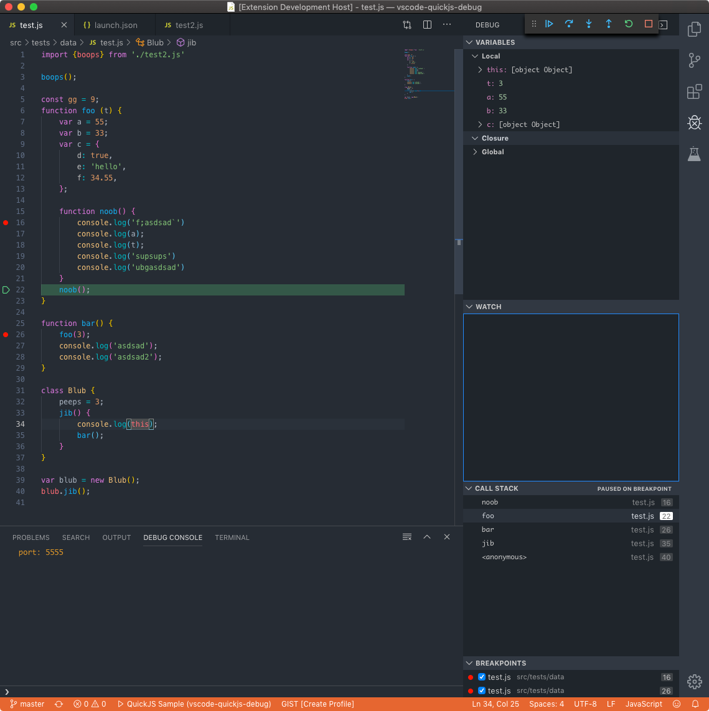

# QuickJS Debug for VS Code

This is a VS Code debug adapter for [QuickJS](https://bellard.org/quickjs/).

QuickJS Debugger supports *stepping*, *continue*, *breakpoints*, *evaluation*, and
*variable access*.

**The official QuickJS release does not have any debugger support.** The QuickJS Debugger requires a forked version of QuickJS, that has minimal changes necessary to support debugging.

## Using QuickJS Debug

* Install the [**QuickJS Debug** extension](https://marketplace.visualstudio.com/items?itemName=koush.quickjs-debug) in VS Code.
* Build the [QuickJS fork](https://github.com/koush/quickjs) from koush.
* Specify the qjs runtime path in [.vscode/launch.json](https://github.com/koush/vscode-quickjs-debug/blob/master/.vscode/launch.json).
* Switch to the debug viewlet and press the gear dropdown.
* Select the debug environment "Launch QuickJS".
* Press the green 'play' button to start debugging.

You can now step through the `test.js` file, set and hit breakpoints.

## Build and Run

* Clone the project
* Open the project folder in VS Code.
* Press `F5` to build and launch QuickJS Debug in another VS Code window. In that window:
  * Open a new workspace, create a new 'program' file `readme.md` and enter several lines of arbitrary text.
  * Switch to the debug viewlet and press the gear dropdown.
  * Select the debug environment "QuickJS Debug Sample".
  * Press `F5` to start debugging.

## Protocol

Protocol documentation is [here](protocol.md).
